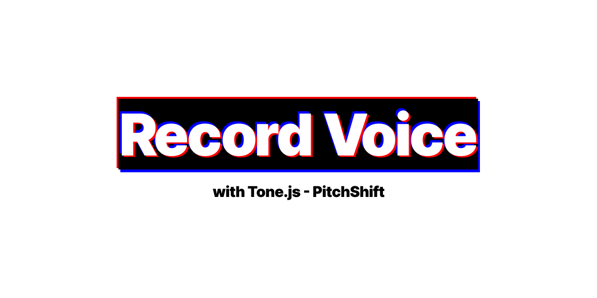

# Record Voice with Tone.js



[The English version is provided below.](#overview)

## 概要

このプロジェクトは、Web ブラウザを使って音声を録音し、ピッチを調整して保存できるアプリケーションです。Tone.js ライブラリを利用して、音声処理を簡単に実現しました。

## 使用技術

- 言語: TypeScript
- ライブラリ: Tone.js
- ビルドツール: Vite
- ホスティング: GitHub Pages

## 主要機能

- 音声録音機能（ブラウザのマイクを使用）
- ピッチ調整（スライダーでリアルタイムに変更可能）
- 録音した音声の保存（WebM 形式）

## 学んだこと

- 音声処理の基本（ピッチ調整、録音）
- Tone.js 使用方法
- TypeScript での堅牢なコード記述方法

## 課題と解決方法

- 問題: 録音機能を実装し、マイクのオンオフ、レコーディングを繰り返すとインスタンスがいくつも発生してしまい、挙動に問題があった
  - 解決: レコーディングのインスタンスをマイクを切るごとに再度作成することで解決

## 今後修正したいこと

- 初期値からピッチの値を変更し、初期値に戻した際、エフェクトが OFF にならない現象が発生すること

## インストール

```
git clone https://github.com/pss-aileen/project-record-voice
cd project-record-voice
npm install
npm run dev
```

---

## Overview

This project is a web application that allows users to record their voice, adjust the pitch, and save the audio. It leverages the Tone.js library to simplify audio processing.

## Tech Stack

- Language: TypeScript
- Library: Tone.js
- Build Tool: Vite
- Hosting: GitHub Pages

## Main Features

- Voice recording (using the browser's microphone)
- Pitch adjustment (real-time control via slider)
- Audio saving in WebM format

## Things I learned

- Fundamentals of audio processing (pitch adjustment, recording)
- How to integrate the Web Audio API with Tone.js
- Writing robust code with TypeScript

## Problem and Solution

- Problem: When implementing the recording functionality, repeatedly toggling the microphone on and off and starting/stopping recording caused multiple instances to be created, leading to unexpected behavior.
  - Solution: Resolved the issue by recreating the recording instance each time the microphone is turned off.

## Next Steps in Development

- Fix PitchShift Bug
  - After changing the pitch and setting it to 0, the voice is not in its default state.

## Install

```
git clone https://github.com/pss-aileen/project-record-voice
cd project-record-voice
npm install
npm run dev
```
